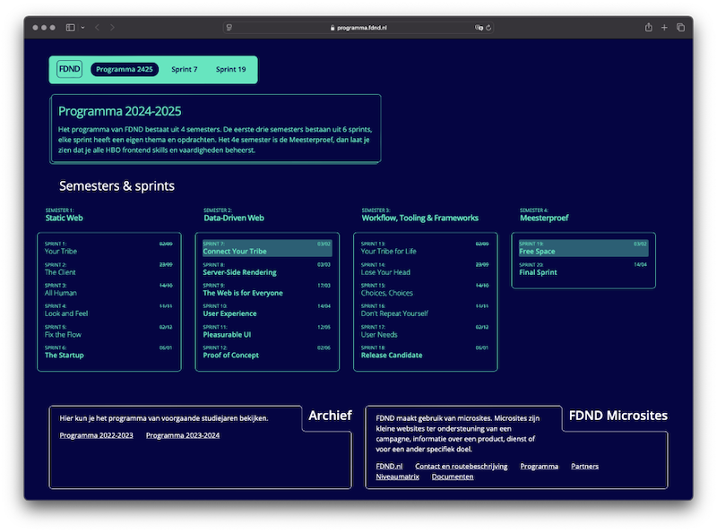

# Connect Your Tribe - Visitekaartje

## Sprint planning

Tijdens de Sprint Planning ga je leren waar Sprint 7 en het semester Data-Driven Web over gaan.


### Aanpak

Deze sprint ga je weer een visitekaartje ontwerpen en maken, net als in Sprint 1. Maar dit keer met NodeJS en data uit de whois API van FDND.

Voordat we daarmee gaan beginnen, gaan we bekijken waar het semester over gaat. Wat betekent het Data-Driven web? En wat is dat eigenlijk, server-side en JSON data uit een API?

<!-- Leren over Server-Side, JSON, Fetch en de WHOIS database -->


## Data-Driven Web

In het eerste semester heb je responsive websites gemaakt met _statische data_, alle content heb je toen in de HTML geschreven. In het Data-Driven Web ga je dit met _dynamische data_ doen. _Dynamische data_ komt uit een database en kan bijvoorbeeld door een klant of opdrachtgever zelf aangepast worden. Teksten en plaatjes schrijf je dan niet in de HTML, maar haal je met een API uit een database.

Bekijk op [programma.fdnd.nl](https://programma.fdnd.nl/) alle sprints van Semester 2. Lees de inleidende teksten op de sprint pagina's en noteer wat je interessant vindt, wat je moeilijk lijkt en/of wat je al kan.


_Op programma.fdnd.nl staan alle sprints voor semester 2_

### Planning maken

Het programma is voller dan Semester 1, dat komt omdat de tweedejaars op stage zijn. Hierdoor kunnen eerstejaars ook 's middags bij FDND werken en leren. 

Maandag- en dinsdagmiddag worden er dit semester practica aangeboden. Dit is voor beginnende en ervaren frontenders nuttig om snel NodeJS te leren, vragen te kunnen stellen en anderen te helpen.

Teken een weekschema op het whiteboard voor de komende 3 weken. Bekijk het programma van Sprint 7 en neem de belangrijke momenten en opdrachten uit het programma op in het schema. Wanneer ga je werken aan de JS fundamentals deeltaak? Wanneer ga je 20% van je tijd besteden aan je I Love Web site? Heb je gezien dat die voor Semester 2 wat uitgebreider is?


## Oefenen met JSON

Voor FDND hebben we een database gemaakt, waar jullie allemaal in staan. Deze database bieden we via een JSON API aan. Bekijk als voorbeeld [een gesorteerde lijst met jullie namen](https://fdnd.directus.app/items/person/?fields=name&filter={%22_and%22:[{%22squads%22:{%22squad_id%22:{%22tribe%22:{%22name%22:%22FDND%20Jaar%201%22}}}},{%22squads%22:{%22squad_id%22:{%22cohort%22:%222425%22}}}]}&sort=name). Dit is JSON data.

Schrijf op het whiteboard je eigen naam, en zoek in [deze gesorteerde lijst met namen, unieke ID's en GitHub profielen](https://fdnd.directus.app/items/person/?fields=id,name,github_handle&filter={%22_and%22:[{%22squads%22:{%22squad_id%22:{%22tribe%22:{%22name%22:%22FDND%20Jaar%201%22}}}},{%22squads%22:{%22squad_id%22:{%22cohort%22:%222425%22}}}]}&sort=name) je eigen naam. Schrijf op het bord welk ID jij hebt in onze database.

Je zag in het vorige voorbeeld dat JSON data meerdere _eigenschappen_ kan hebben:

```json
{
	"name": "FDND Student",
	"id": 234,
	"github_handle": "fdnd"
}
```

En dat een JSON object uit een _lijst_ (array) van meerdere objecten kan bestaan:

```json
[
	{
		"name": "FDND Student",
		"id": 234,
		"github_handle": "fdnd"
	},
	{
		"name": "Iemand anders",
		"id": 456,
		"github_handle": null
	}
]
```

JSON is een standaard die veel gebruikt wordt in JavaScript. Niet geheel ontoevallig, want JSON staat voor _JavaScript Object Notation_.

Schrijf als oefening op het whiteboard allemaal een simpel JSON object over jezelf, met bijvoorbeeld je naam en squad. Voeg ook iets toe wat je zelf hebt verzonnen. Net als wat je bij je poster voor de Expo deed, maar dan niet als Custom Property in CSS, maar in JSON formaat. Welke verschillen zie je in de syntax?

Mocht je willen weten welke data we nog meer in onze whois database klaar hebben staan, kijk dan naar [de volledige JSON](https://fdnd.directus.app/items/person/?fields=*,squads.squad_id.name,squads.squad_id.cohort&filter={%22_and%22:[{%22squads%22:{%22squad_id%22:{%22tribe%22:{%22name%22:%22FDND%20Jaar%201%22}}}},{%22squads%22:{%22squad_id%22:{%22cohort%22:%222425%22}}}]}&sort=name).

Zoals je merkt, is dit lastig lezen, omdat er van veel studenten veel data is. JSON is niet gemaakt om leesbaar te zijn voor mensen, maar vooral om makkelijk en snel data over te brengen tussen software. Vaak dus met JavaScript, maar JSON kan in vrijwel iedere programmeertaal gebruikt worden.

Om alleen jouw gegevens te krijgen, kun je de volgende link gebruiken: https://fdnd.directus.app/items/person/?filter={%22id%22:234} — pas in de URL `234` aan naar jouw eigen ID, die je net op het whiteboard hebt geschreven. Als het goed is, krijg je dan maar één JSON object terug.

💡 Binnen FDND hebben we overigens niet alleen JSON data van studenten, maar ook van [alle sprints](https://programma.fdnd.nl/api/data-driven-web/connect-your-tribe) en [onze niveaumatrix](https://niveaumatrix.fdnd.nl/niveaumatrix.json).


### Bronnen

- [Working with JSON @ MDN](https://developer.mozilla.org/en-US/docs/Learn_web_development/Core/Scripting/JSON)


## Fetch data

- ze daarna eerst met fetch() in de browser laten oefenen met dynamische json ophalen uit onze API (id 234 is een Dummy student), gewoon in een JS file met console logs
- ze hun eigen id laten gebruiken voor zo’n fetch, zodat ze leren dat ze URLs kunnen veranderen, met bijv let studentID = 234; let url = apiUrl + studentID, nog steeds gewoon via console log
- Daarna pas via de Whois admin hun eigen data aanpassen (ik heb op het custom json field validatie toegevoegd, dus ze kunnen hier meteen eigen data invullen)
- via client side JS controleren of dat gelukt is (wow momentje!)

